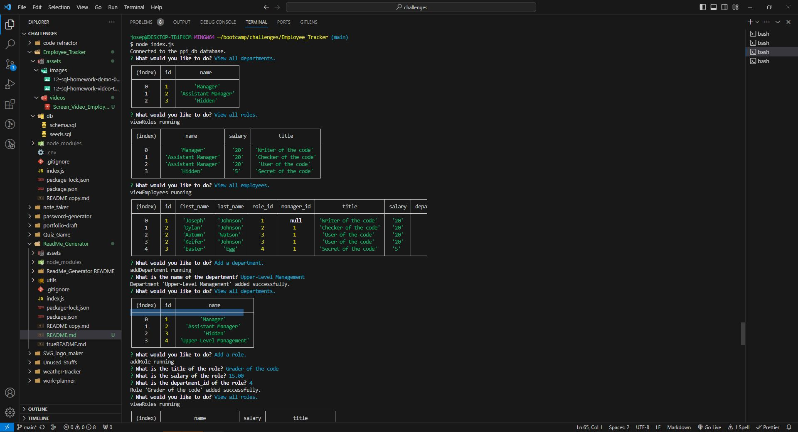

# Employee_Tracker
I want to create a content management system (CMS) in MySQL that allows non-developers to easily view and interact with information stored in databases.

## Description

 - I want to create a content management system (CMS) in MySQL that allows non-developers to easily view and interact with information stored in databases.

## Table of Contents

  - [Credits](#credits)
  - [Badges](#badges)
  - [Features](#features)
  - [Questions](#questions)
  - [Screenshot](#screenshot)
  - [Video](#video)
  - [DeployedApp](#deployedApp)

## Credits

 - This website was coded by Joseph Dakota Johnson.

 - Instructor Caleb Crum helped me during class office hours by helping me complete the 'updateEmployee' function. [Caleb's GitHub account](https://github.com/CalebCrumInstructor)

 - Tutor Andres Jimenez helped me during a tutoring session by helping me figure out how to create the inquirer prompt and the 'viewDepartments', 'viewRoles', and 'viewEmployees' functions.

 - My brother (boot camp graduate) helped me out by helping me figure out how to set up the assignment and create the 'addDepartment', 'addRole', and 'addEmployee' functions.

## Badges

 - HTML
 - CSS
 - JavaScript

## Features

 - When the user types "mysql -u (their username) -p", types their password, clicks Enter, types "SOURCE db/schema.sql
 - ", clicks Enter, types "SOURCE db/seeds.sql
 - ", clicks Enter, holds CTRL and clicks C, and types "node index.js"...
 - Then the user is presented with a prompt that says "What would you like to do?".
 - When the user selects "View all departments.", "View all roles.", or "View all employees."...
 - Then the user is presented with the appropriate "departments", "roles", or "employees" table.
 - When the user selects "Add a department.", "Add a role.", or "Add an employee."...
 - Then the user is presented with another appropriate prompt (of) question(s) to help them add an new department, role, or employee.
 - When the user selects "Update an employee role."...
 - Then the user is presented with a prompt asking first
 -  "Which employee?" then second
 -  "What role?" to update an employee's role in the database.
 - If a user watches the video from the video link in this README.md, then they will see all of this in action.

## Questions

 - If you have any questions for me, my GitHub account is [Dakota's GitHub account](https://github.com/josephdakotajohnson).

## Screenshot

 - This is a screenshot of the application: .

## Video

 - https://drive.google.com/file/d/1qK4RkjT-SEw6u70166wLvQgWVdX_XTP5/view

## DeployedApp

 - This is a link to the fully deployed application: (https://josephdakotajohnson.github.io/Employee_Tracker/).
